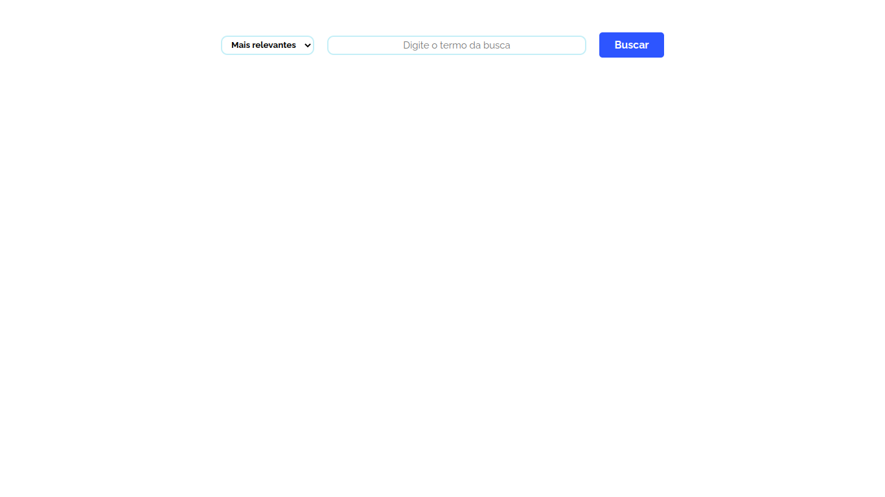
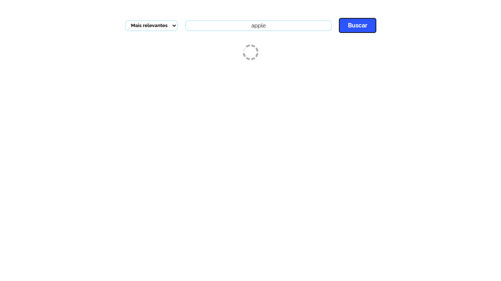
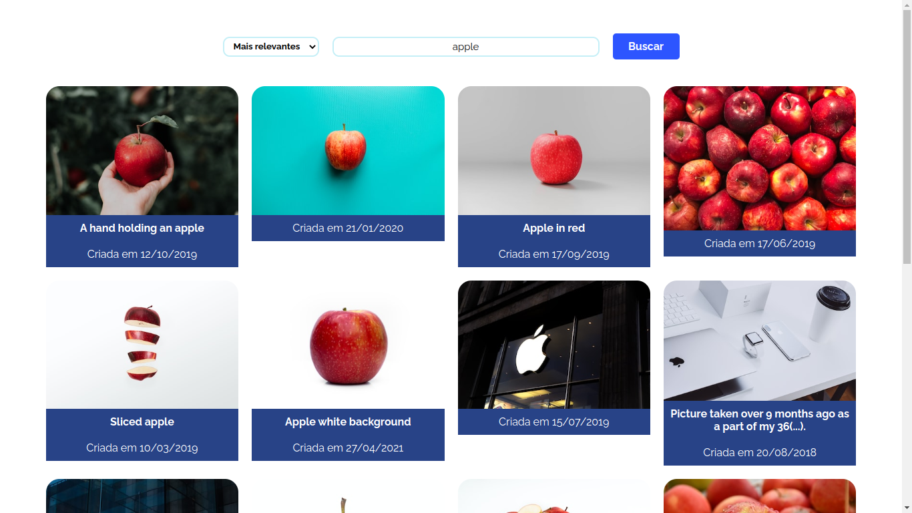
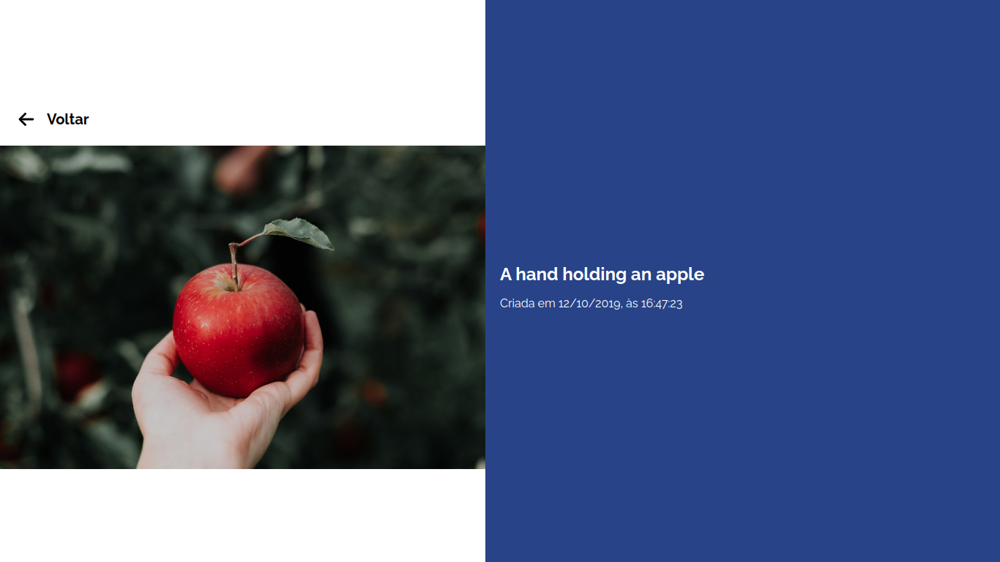

# fotorama

## Sumário

- [fotorama](#fotorama)
  - [Sumário](#sumário)
  - [Motivação](#motivação)
  - [Pilha de tecnologia](#pilha-de-tecnologia)
  - [Galeria](#galeria)
  - [Como rodar](#como-rodar)
    - [Pré-requisitos](#pré-requisitos)
    - [Passo a passo](#passo-a-passo)
  - [Referências bibliográficas](#referências-bibliográficas)

## Motivação

Este app consiste em uma galeria de fotos utilizando a API do site [Unsplash](https://unsplash.com/). O Unplash, por sua vez, consiste em um site dedicado à fotografia proprietária. Desde 2021, é propriedade da Getty Images. O site reivindica cerca de 322.256 fotógrafos contribuintes e já gerou mais de 941 bilhões de impressões de fotos por mês em sua crescente biblioteca de mais de 4,7 milhões de fotos.[<sup>[1]</sup>](#referencia-bibliografica-1)

Vale destacar que parte do app foi desenvolvida pelo professor e a atividade consistiu em finalizá-lo, adicionando a página de detalhes de uma foto, um filtro de pesquisa e o contexto de usuário.

Este foi o terceiro repositório de código apresentado no [Curso Superior de TSI do IFMS](https://www.ifms.edu.br/campi/campus-aquidauana/cursos/graduacao/sistemas-para-internet/sistemas-para-internet) como requisito para obtenção da nota parcial das atividades da unidade curricular Construção de Páginas Web III.

## Pilha de tecnologia

As seguintes tecnologias foram utilizadas para desenvolver este app:

| Papel | Tecnologia |
|-|-|
| Ambiente de execução | [Node](https://nodejs.org/en/) |
| Linguagem de programação | [TypeScript](https://www.typescriptlang.org/) |
| Ambiente de desenvolvimento | [Vite](https://vitejs.dev/) |
| Biblioteca de interface de usuário | [React](https://pt-br.reactjs.org/) |
| Base de dados | [Unsplash](https://unsplash.com/) |

## Galeria






## Como rodar

### Pré-requisitos

- [Node](https://nodejs.org/en/download/);
- [Yarn](https://yarnpkg.com/) (opcional);
- Conta de desenvolvedor no site [Unsplash](https://unsplash.com/developers).

### Passo a passo

1. Clone o repositório de código em sua máquina;
   
2. Abra um shell de comando de sua preferência (prompt de comando, PowerShell, terminal _etc_.);
   
3. Instale as dependências do projeto através do seguinte comando:

```console
$ npm install
```

Caso esteja utilizando o gerenciador de pacotes Yarn, execute o seguinte comando como alternativa:

```console
$ yarn
```

4. Com as dependências instaladas, crie um arquivo intitulado `.env` na raiz do projeto e adicione o seguinte conteúdo nele:

```properties
VITE_UNSPLASH_ACCESS_KEY=
```

Tal arquivo deve conter a chave de acesso de um app registrado pelo site Unsplash. Então, caso ainda não tenha uma conta de desenvolvedor, [registre-se](https://unsplash.com/developers).

5. [Crie um app](https://unsplash.com/oauth/applications) no site Unsplash. É digno de nota que apps recém-criados estarão em modo de demonstração e terão uma taxa limitada de cinquenta requisições por hora;

6. Copie e cole a chave de acesso[<sup>1</sup>](#nota-de-rodape-1) do app criado no valor da variável de ambiente `VITE_UNSPLASH_ACCESS_KEY`;

7. Finalmente, execute o seguinte comando para iniciar o app:

Para npm:

```console
$ npm run dev
```

Para Yarn:

```console
$ yarn dev
```

<sup id="nota-de-rodape-1">1</sup> Cuidado para não confundir a chave de acesso com a chave secreta.

## Referências bibliográficas

<span id="referencia-bibliografica-1">[1]</span> UNSPLASH Stats: See how the Unsplash community has grown over time. [_S_. _l_.]: Unsplash, 7 jan. 2023. Disponível em: https://unsplash.com/stats. Acesso em: 7 jan. 2023.